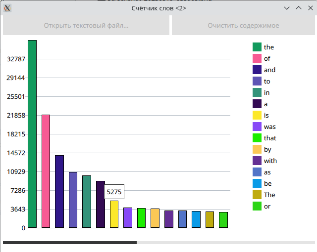

# WordCounter - Счётчик слов

QML-based word counter application

Приложение, считывающее текстовый файл и выводящее на экран столбиковую диаграмму, отображающее количество слов в файле. График обновляется по мере считывания файла.



## Пример запуска
```bash
$ ./WordCounter [n]

n - количество обрабатываемых строк за одну итерацию (по умолчанию 1000)
```

## Архитектура приложения

Приложение состоит из 3 потоков:
    - Поток загрузки файла `FileLoaderThread`: Объект FileLoader в потоке считывает n строк из файла и передаёт их объекту ContentProcessor
    
    - Поток обработки данных `ContentProcessorThread`: Объект ContentProcessor обрабатывает n строк, обрабатывая слова и обновляя контейнер с 15 самыми встречаемыми словами в тексте. Обработка нескольких строк одновременно позволяет ускорить работу алгоритма, так как при каждой итерации алгоритма необходимо производить сортировку контейнера с найденными словами.
    
    - Поток отображения графики. К данном потоку привязан объект `Controller`, который при инициализации конструирует вышеописанные объекты, запускает потоки, отвечает за взаимодействие  объектов и графического интерфейса.

По окончании обработки очередного набора данных объект `ContentProcessor` сообщает объекту `Controller` об обновлении данных. В свою очередь `Controller` обращается к данным `ContentProcessor` с помощью прямого вызова (для синхронизации доступа к данным используется `QMutexLocker`).

## Взаимодействие с графическим интерфейсом

При нажатии на кнопку `Открыть текстовый файл...` отображается диалоговое окно, где пользователю предлагается выбрать текстовый файл.

В нижней части экрана представлен индикатор, отображающий прогресс анализа файла.

Кнопка `Очистить содержимое` позволяет очистить графический интерфейс и произвести анализ файла заново.

В правой части экрана представлена легенда графика. При наведении на столбцы графика отображается точное значение соотвествующих слов в тексте.

Интерфейс учитывает размеры окна.


